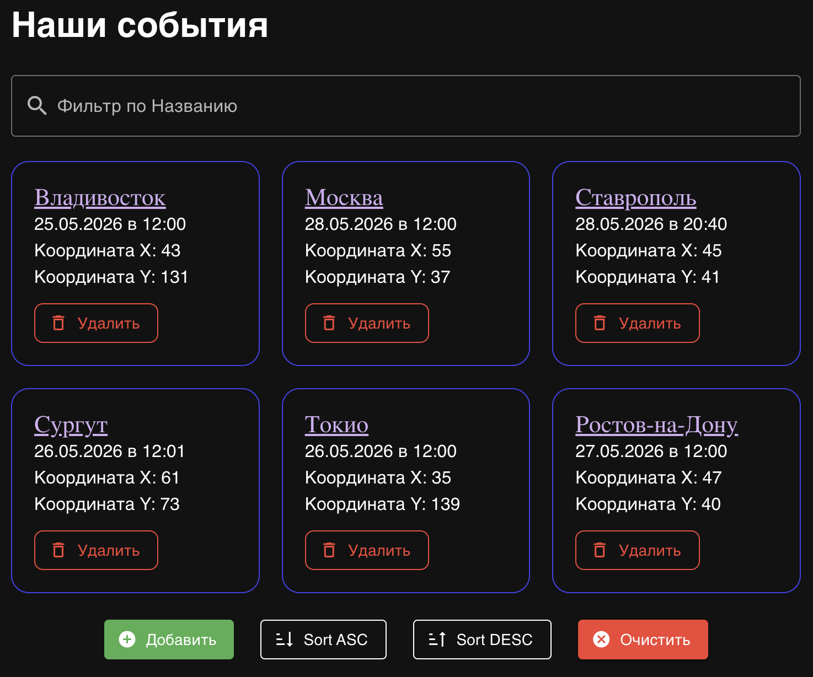
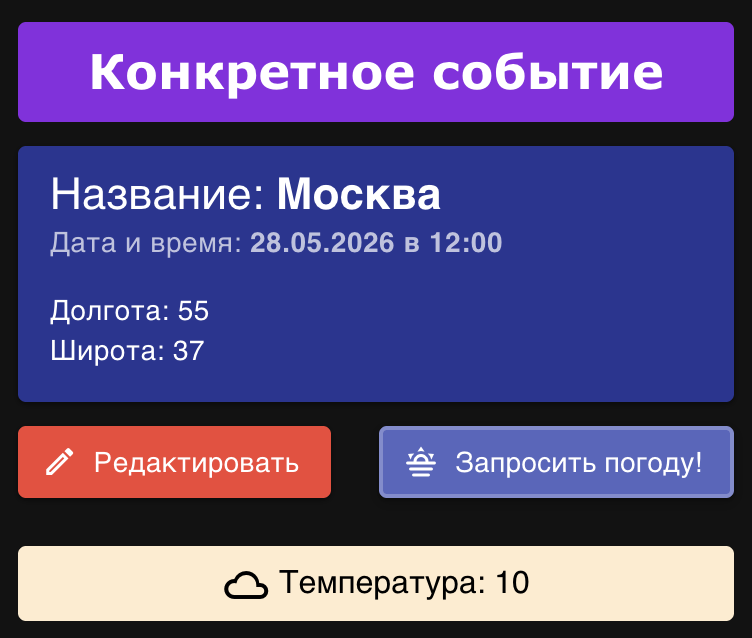

# Тестовое задание: Список событий (Event List)

Фронтенд-приложение для управления списком событий с интеграцией прогноза погоды и интерактивной картой.

## 📱 Скриншоты интерфейса

## 



## 🛠 Стек технологий

- **Фреймворк:** Vue 3 (Composition API, `<script setup>`)
- **Утилиты:** VueUse (реактивные обёртки над браузерным API)
- **Типизация:** TypeScript
- **Стили и компоненты:** Vuetify 3
- **Работа с датами:** Day.js
- **Сборщик:** Vite

---

## 🚀 Функционал и статус реализации

### Основные возможности:

- [x] **CRUD событий:** Создание, чтение, обновление и удаление событий (поля: название, дата, время, координаты места).
- [x] **Отображение:** Вывод событий списком. По умолчанию настроена сортировка по возрастанию.
- [x] **Персистентность:** Полное сохранение и синхронизация данных списка событий в `localStorage`.
- [x] **Поиск и сортировка:** Реализован динамический поиск событий по названию и сортировка списка.
- [ ] **Фильтрация:** Фильтр по датам _(не реализовано)_.

### Опционально (дополнительный функционал):

- [x] **Интеграция с API погоды:** Написан реактивный композабл `useWeather` для динамического запроса и отображения погоды, привязанной к месту (координатам) и времени события.

---

## 📦 Архитектурные особенности

1.  **Кастомные Composable-функции:** Бизнес-логика вынесена из компонентов. Логика запроса погоды инкапсулирована в функции `useWeather()`, использующей безопасное разворачивание реактивных аргументов через `toValue()`.
2.  **Строгая типизация:** Все структуры данных (события, параметры API) описаны строгими интерфейсами TypeScript (`ourEventType`, `useWeatherType`), что предотвращает ошибки на этапе компиляции.
3.  **Интеграция с картами:** Реализована работа с географическими координатами городов (Москва, Владивосток, Сургут, Ростов-на-Дону, Токио и др.).

---

## 🛠 Инструкция по развёртыванию

### 1. Клонирование репозитория

```bash
git clone https://github.com/alexkostinprog/test-events/tree/main
cd test-events
```

### 2. Установка зависимостей

```bash
npm install
```

### 3. Запуск сервера для разработки

```bash
npm run dev
```

Приложение будет доступно по адресу `http://localhost:5173` (или указанному в консоли).

### 4. Сборка для продакшена

```bash
npm run build
```
